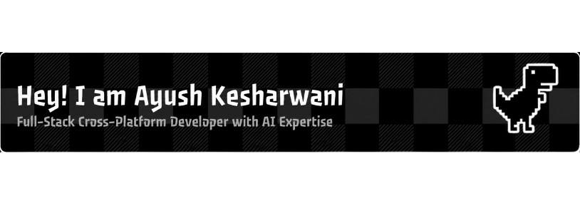

 

<div align="center">

    
[](https://git.io/typing-svg)

---
</div>


## 

I'm a passionate **Computer Engineering undergraduate** at **Modern Education Socitey's Wadia College Of Engineering Pune (MESWCOE)**, driven by the art of transforming ideas into impactful digital solutions.

```javascript
const Ayush = {
    pronouns: "He" | "Him",
    location: "Pune, Maharashtra, India",
    education: "Computer Engineering @ MESWCOE",
    currentFocus: ["Full-Stack Development", "AI/ML Applications", "System Design"],
    askMeAbout: ["Web Dev", "AI/ML", "System Architecture", "Problem Solving"],
    technologies: {
        frontEnd: ["React.js", "Next.js"],
        backEnd: ["Node.js", "Express.js", "Flask", "FastAPI"],
        databases: ["MongoDB", "SQL", "MYSQL"],
        ai_ml: ["LangChain", "HuggingFace", "TensorFlow"],
        languages: ["JavaScript", "TypeScript", "Python", "C++", "Java", "SQL"]
    },
    currentlyLearning: ["Microservices", "Cloud Computing"],
    motto: "Code. Learn. Build. Repeat."
};
```

## 🎯 What I'm Up To

- 🔭 **Currently Working On:** Building scalable AI-powered applications
- 🌱 **Learning:** Advanced system design patterns and cloud architectures
- 👯 **Looking to Collaborate:** Open source projects and innovative hackathon ideas
- 🤔 **Exploring:** The intersection of AI/ML with web technologies
- 💬 **Ask Me About:** Full-stack development, DSA, or anything tech!
- ⚡ **Fun Fact:** I debug with console.log() and I'm not ashamed! 
- 🛠️ Turning wild ideas into working projects (after a few spectacular fails).
- 🌐 Aim: tech that’s **useful, accessible, and rage-quit free.**

## 🤝 Let's Connect & Collaborate

<div align="center">
;Ping+me+to+collaborate!;Let's+build+something+amazing!;Open+to+new+opportunities!;Always+ready+to+discuss+tech!" width="250"/>

[](https://www.linkedin.com/in/ayushkesharwani1207)
[](mailto:kesharwaniayush1207@gmail.com)
[](https://x.com/Kesha56922Ayush)
[](https://github.com/kesharwaniayush)

<picture>
  <source media="(prefers-color-scheme: dark)" srcset="https://raw.githubusercontent.com/platane/platane/output/github-contribution-grid-snake-dark.svg">
  <source media="(prefers-color-scheme: light)" srcset="https://raw.githubusercontent.com/platane/platane/output/github-contribution-grid-snake.svg">
  
</picture>

</div>


## 
<div align="center">


 
 
 
 
 
 


 

 
 
 
 
 
 
 
 
 
 
 
 
 
 
 
 
 
 
 
 
 
 
 
 
 
 
 
 
 
</div>


## 
<div align="center">

| **DevRank**[🔗](https://dev-rank-delta.vercel.app/) | **dev path**[🔗](https://devpath-kohl.vercel.app/) | **GramConnect**[🔗](https://gram-connect.vercel.app/) | **AI Resume Analyzer**[🔗](https://hackathon-hacktoberfest-2025.vercel.app/) | **LegaliTea AI**[🔗](https://legalitea-genai.vercel.app/) ||

</div>


|                                  **🃏 Daily Dose of Humor**                                   |                                            **💬 Quotes & Inspiration**                                            |                                                                                          **💻 Programming Quotes**                                                                                          |
| :-------------------------------------------------------------------------------------------: | :---------------------------------------------------------------------------------------------------------------: | :---------------------------------------------------------------------------------------------------------------------------------------------------------------------------------------------------------: |
|  |  |  |


|                                **🎭 Programming Memes**                                 |
| :-------------------------------------------------------------------------------------: |
|  |


